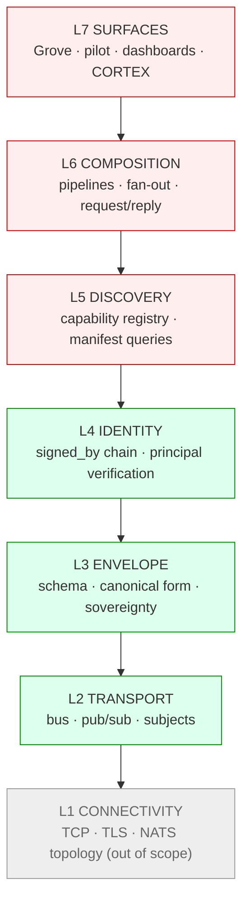

# Myelin Architecture

> **Scope:** This document defines myelin's seven-layer protocol stack — the contracts each layer guarantees, the code that implements them today, and the issues that track open work.
>
> **Status:** Living document. Closes the first acceptance criterion of [myelin#7](https://github.com/the-metafactory/myelin/issues/7) (*"Seven-layer model documented in myelin"*).
>
> **Maintenance obligation:** Every spec change that adds, removes, or alters a layer's contract MUST update the relevant section here in the same PR. A layered architecture only stays coherent if the doc and the code change together. *(Originating recommendation: Luna review on myelin#31, May 2026.)*

---

## 1. Why myelin is layered

Myelin is the protocol stack the metafactory ecosystem runs on — the envelopes, transports, identities, and composition patterns that connect agents across operators. It is a stack, not a single thing.

The discipline of the OSI / TCP-IP layered model — narrow inter-layer interfaces, swappable implementations, explicit cross-layer concerns — is what made the internet's protocol stack durable across forty years of underlying-tech turnover. Applying that lens to myelin while it is still small costs less than retrofitting it later.

The seven-layer model below is **the canonical metafactory protocol stack**. It supersedes the v4 nervous-system five-layer naming (MYELIN / AXON / DENDRITE / SYNAPSE / CORTEX). Two changes from v4: Identity is named as its own layer, and CORTEX is repositioned as a Layer 7 application rather than a peer layer. Rationale in [myelin#5](https://github.com/the-metafactory/myelin/issues/5).

## 2. The stack

```
┌─────────────────────────────────────────────────────────────┐
│  L7  SURFACES        Grove · pilot · signal-collector ·     │
│                      dashboards · CORTEX (capability AI)    │
├─────────────────────────────────────────────────────────────┤
│  L6  COMPOSITION     Pipeline · fan-out/fan-in ·            │
│                      request/reply · negotiation            │
├─────────────────────────────────────────────────────────────┤
│  L5  DISCOVERY       Capability registry · manifest queries │
│                      · runtime type matching                │
├─────────────────────────────────────────────────────────────┤
│  L4  IDENTITY        Verifiable principal · signed_by       │
│                      chain · sovereignty attestation        │
├─────────────────────────────────────────────────────────────┤
│  L3  ENVELOPE        Envelope schema · canonical form ·     │
│                      sovereignty metadata · namespace       │
├─────────────────────────────────────────────────────────────┤
│  L2  TRANSPORT       Bus · pub/sub · request/reply ·        │
│                      delivery guarantees · subjects         │
├─────────────────────────────────────────────────────────────┤
│  L1  CONNECTIVITY    TCP · TLS · NATS leaf-node topology    │
│                      (out of scope — internet plumbing)     │
└─────────────────────────────────────────────────────────────┘
```

Diagram (mermaid, render-friendly):



## 3. Per-layer summary

| Layer | Charter | Code | Source-of-truth issue | Status |
|---|---|---|---|---|
| **L7 Surfaces** | Applications consuming the stack | (other repos: grove, pilot, signal) | — | external |
| **L6 Composition** | Patterns for combining envelopes (pipeline, fan-out, request/reply) | — | [#10](https://github.com/the-metafactory/myelin/issues/10) | spec pending |
| **L5 Discovery** | Runtime queryable capability registry | — | [#9](https://github.com/the-metafactory/myelin/issues/9) | spec pending |
| **L4 Identity** | Verifiable per-envelope principal; signed_by chain | `src/identity/` | [#8](https://github.com/the-metafactory/myelin/issues/8) (closed), [#31](https://github.com/the-metafactory/myelin/issues/31) (chain) | implemented (single-stamp); chain proposed |
| **L3 Envelope** | Envelope schema, canonical encoding, sovereignty metadata, NATS namespace | `src/envelope.ts`, `src/types.ts`, `schemas/envelope.schema.json`, `specs/namespace.md` | [#6](https://github.com/the-metafactory/myelin/issues/6) (namespace) | implemented |
| **L2 Transport** | Abstract bus interface; pub/sub + request/reply; subject-based addressing | `src/transport/` | [#12](https://github.com/the-metafactory/myelin/issues/12) (closed) | implemented (NATS + InMemory) |
| **L1 Connectivity** | TCP, TLS, NATS leaf-node topology | (NATS server config; not in this repo) | — | out of scope |

**Cross-layer:** [myelin#11](https://github.com/the-metafactory/myelin/issues/11) — sovereignty enforcement protocol that cuts across L3 (declared), L4 (attested), and L2 (enforced).

## 4. Layer details

### L1 — Connectivity *(out of scope)*

**Charter.** Internet plumbing: TCP, TLS, NATS server topology (operator hubs, leaf nodes, federation links). Out of scope for myelin — we don't define it, we just run on top of it.

**Why we name it.** OSI taught us that pretending the lower layer doesn't exist leads to buggy higher layers. Myelin assumes L1 provides authenticated, encrypted, ordered byte streams. If L1 fails (network partition, TLS expiry), every layer above degrades together — that's a feature, not a bug, and the layer model surfaces the dependency cleanly.

---

### L2 — Transport

**Charter.** Provide an abstract bus with pub/sub and request/reply semantics, subject-based addressing, and explicit delivery guarantees. Higher layers MUST NOT import a concrete transport (NATS, Kafka, etc.) directly — they compose against the abstract `Transport` interface so implementations can be swapped without rewriting publishers and subscribers.

**Code.** `src/transport/`

- `types.ts` — `TransportPublisher`, `TransportSubscriber`, `EnvelopePublisher`, `EnvelopeSubscriber`, `Subscription` interfaces.
- `nats.ts` — NATS implementation (`NATSTransport`).
- `in-memory.ts` — `InMemoryTransport` for tests, with `subjectMatchesPattern` helper.
- `envelope.ts` — `EnvelopeTransport` wrapper that adds envelope canonicalization.
- `factory.ts` — `createTransport` for config-driven selection.
- `test-envelope-transport.ts` — observable test double.

**Source-of-truth issue.** [myelin#12](https://github.com/the-metafactory/myelin/issues/12) (closed — abstract interface landed).

**Status.** Implemented. The abstract `TransportPublisher` / `TransportSubscriber` interfaces are the load-bearing contract. NATS is the production implementation; InMemory drives tests.

**Open contract questions.**
- Delivery guarantees (at-most-once vs at-least-once vs exactly-once) are currently NATS-shaped. A second transport (e.g. an HTTP webhook bridge) would force this to become an explicit per-method contract.
- JetStream-specific semantics (pull consumers, durables) are reachable via `NATSTransport` but not part of the abstract interface. That's deliberate for now — promotion to abstract is a future call.

---

### L3 — Envelope

**Charter.** Define the wire format every message uses: canonical schema, ID conventions, timestamp rules, sovereignty metadata, the NATS subject namespace, and the explicit boundary between signable and mutable fields. The envelope is the unit of sovereignty travel — *"sovereignty travels with the message"* is an L3 invariant.

**Code.**

- `src/envelope.ts` — `createEnvelope`, `validateEnvelope`.
- `src/types.ts` — `MyelinEnvelope` TypeScript interface.
- `schemas/envelope.schema.json` — JSON Schema (draft 2020-12).
- `specs/namespace.md` — local / federated / public NATS subject prefixes.

**Source-of-truth issue.** [myelin#6](https://github.com/the-metafactory/myelin/issues/6) (MY-101 namespace).

**Status.** Implemented. This is the cleanest layer in the stack — designed to a contract from the start, no transport coupling.

**Inside vs outside the signature.** The envelope distinguishes attested fields (inside signature) from mutable fields (`correlation_id`, `economics`, `extensions`). This rule is foundational for L4 and is documented authoritatively in [`design/identity-chain-of-stamps.md` §4.3](../design/identity-chain-of-stamps.md) — clients MUST NOT make trust decisions based on mutable-field values.

---

### L4 — Identity

**Charter.** Provide a verifiable principal for every envelope, transport-independent. Receivers MUST be able to verify *who sent this message* without trusting the transport that delivered it. Identity verification is also the substrate on which L6 sovereignty enforcement and accountability composition are built.

**Code.** `src/identity/`

- `types.ts` — `Principal`, `SignedBy` (Ed25519 + hub-stamp), `VerificationResult`.
- `canonicalize.ts` — JCS (RFC 8785) canonicalization for the signing payload.
- `sign.ts` — `signEnvelope` (single-signer today).
- `verify.ts` — `verifyEnvelopeIdentity`, `requireVerifiedIdentity`.
- `registry.ts` — `PrincipalRegistry` (file-backed and in-memory).

**Source-of-truth issues.**
- [myelin#8](https://github.com/the-metafactory/myelin/issues/8) (closed) — original L4 identity spec.
- [myelin#31](https://github.com/the-metafactory/myelin/issues/31) (open) — chain-of-stamps proposal extending `signed_by` from a single signer to a notary chain. Design memo: [`design/identity-chain-of-stamps.md`](../design/identity-chain-of-stamps.md).

**Status.** Single-signer (origin attestation) implemented; chain-of-stamps (path attestation) proposed.

**Cross-layer notes.** L4 attests origin today; once chain-of-stamps lands, L4 attests *path* — which is the prerequisite for L6 sovereignty enforcement at every hop, not just at L1 of trust.

---

### L5 — Discovery *(spec pending)*

**Charter.** Make the set of available capabilities runtime-queryable. An agent MUST be able to ask *"who can summarize text right now?"* without prior knowledge of peer subjects.

**Code.** None yet. Today, agent manifests in `~/.config/metafactory/pkg/repos/<agent>/agent/` are static — no runtime registry.

**Source-of-truth issue.** [myelin#9](https://github.com/the-metafactory/myelin/issues/9).

**Status.** Spec pending. Static manifests work for the current handful of agents; runtime discovery becomes load-bearing once the agent count grows or capability matching needs to consider live availability, sovereignty, or quality signals.

---

### L6 — Composition *(spec pending)*

**Charter.** Formalize the patterns by which envelopes combine into useful workflows: pipelines, fan-out / fan-in, request/reply, negotiation. Today these patterns exist in the wild (pilot review loop, signal flows) but are reinvented per use.

**Code.** None canonical. Each composition is implemented bespoke in the consuming repo (grove, pilot, signal-collector).

**Source-of-truth issue.** [myelin#10](https://github.com/the-metafactory/myelin/issues/10).

**Status.** Spec pending. The right take per the v4 vision is "let it emerge" — formalize once the common patterns are visible. Several patterns are now visible (pipeline-with-review, fan-out + fan-in collectors, request/reply with timeout) and are candidates for first formal specification.

---

### L7 — Surfaces *(external)*

**Charter.** Applications that consume the stack. Grove, pilot, signal-collector, dashboards, the future CORTEX capability AI. Out of scope for *this* repo — we do not own L7 implementations — but they are part of the model because their existence shapes the contracts the layers below must offer.

**Code.** Other repos: grove, pilot, signal-collector. Their architecture docs are authoritative for their own internals.

**Status.** External. Layer included in the stack diagram so the model is complete; not specified here.

## 5. Cross-layer invariants

Some concerns deliberately span layers and cannot live in any single one. The model names them explicitly so they are not lost.

### 5.1 Sovereignty (declared L3, attested L4, enforced L2)

Sovereignty metadata is *declared* in the envelope at L3. It is *cryptographically attested* via signed_by at L4 (and once chain-of-stamps lands, attested at every hop, not just origin). It is *enforced* at L2 — the transport refuses to route an envelope across an operator boundary if the sovereignty claim is not satisfied.

Tracking issue: [myelin#11](https://github.com/the-metafactory/myelin/issues/11).

### 5.2 Mutable fields are NOT trust-bearing

`correlation_id`, `economics`, and `extensions` are intentionally outside the L4 signature so intermediaries can annotate observability and economics state without invalidating attestations. **Hard contract:** clients MUST NOT make security or trust decisions based on mutable-field values. Anything that needs to be both mutable AND attested is a signal to add a new attested mechanism (e.g. a per-stamp extensions bag once chain-of-stamps lands), not to expand the carve-out.

### 5.3 Transport-independence

L4 identity verification MUST work regardless of which L2 transport delivered the envelope. The signature covers envelope content, not transport metadata. A bot's identity is the same whether the message rode NATS, an HTTP webhook bridge, or anything else.

### 5.4 Operator sovereignty over registries

Each operator owns its principal registry (L4) and its capability registry (L5 once specified). There is no global authority. Cross-operator trust is established by explicit federation handshake (out of scope for v1).

## 6. Design conventions

These are repo-wide conventions that follow from the layered model:

- **No layer skipping in code.** Higher-layer code does not import lower-layer concrete implementations directly. L7 code that needs to publish does so through L3+L4 (envelope + signed_by) over L2 (abstract transport), never by speaking NATS directly.
- **Each layer's contract change requires a doc update.** The maintenance obligation in §0 isn't optional — it is the only thing that keeps the model honest.
- **Cross-layer concerns get their own section here.** Don't wedge them into a single layer. §5 is the place.
- **External repos consume contracts, never internals.** Grove, pilot, etc. depend on the layers' published APIs (`@the-metafactory/myelin` exports, schema, namespace spec). They do not import private files from this repo.
- **Issue lineage matches doc lineage.** Per `compass/sops/design-process.md`: research → DD → spec → issue → code. Each layer here points to its source-of-truth issue.

## 7. Glossary

- **Envelope** — the universal message format. Every signal that crosses myelin is wrapped in one.
- **Principal** — the verifiable identity of the sender. Today: `did:mf:<name>` shape, ed25519 key, registry-resolvable.
- **Sovereignty** — declarative metadata about who owns / classifies / constrains a message. Travels with the envelope.
- **Hub-stamp** — a signing method where a trusted hub signs on behalf of an agent that does not directly hold a key. Future: chain-aware role-scoped (myelin#31).
- **JCS** — JSON Canonicalization Scheme, RFC 8785. Used at L4 to produce deterministic signing bytes.
- **Operator** — a metafactory deployment under a single trust boundary (e.g. `metafactory.grove`). Sovereignty boundaries follow operator boundaries.

## 8. Status snapshot (May 2026)

| Layer | Maturity |
|---|---|
| L1 | external |
| L2 | implemented (NATS + InMemory) |
| L3 | implemented |
| L4 | implemented (single-signer); chain proposed in #31 |
| L5 | spec pending (#9) |
| L6 | spec pending (#10) |
| L7 | external (per-repo) |
| cross-layer (sovereignty) | spec pending (#11) |

When this snapshot drifts from reality, fix it in the same PR as the underlying change.

---

*Originating discussion: Luna recommendation in Discord, May 2026, after myelin#31 design review surfaced the lack of an architectural anchor above per-layer specs. Closes the first AC of [myelin#7](https://github.com/the-metafactory/myelin/issues/7).*
