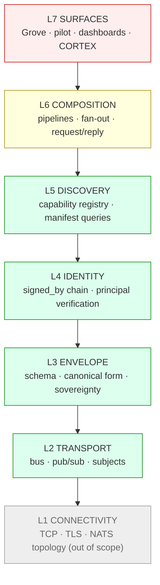

# Myelin Architecture

> **Scope:** This document defines myelin's seven-layer protocol stack — the contracts each layer guarantees, the code that implements them today, and the issues that track open work.
>
> **Status:** Living document. Closes the first acceptance criterion of [myelin#7](https://github.com/the-metafactory/myelin/issues/7) (*"Seven-layer model documented in myelin"*).
>
> **Maintenance obligation:** Every spec change that adds, removes, or alters a layer's contract MUST update the relevant section here in the same PR. A layered architecture only stays coherent if the doc and the code change together. A CI guard (`scripts/check-architecture-coverage.ts`, wired into `.github/workflows/lint.yml`) fails the build when a top-level `src/` module has no `src/<name>` mention here. *(Originating recommendation: Luna review on myelin#31, May 2026.)*

---

## 1. Why myelin is layered

Myelin is the protocol stack the metafactory ecosystem runs on — the envelopes, transports, identities, and composition patterns that connect agents across networks. It is a stack, not a single thing.

The discipline of the OSI / TCP-IP layered model — narrow inter-layer interfaces, swappable implementations, explicit cross-layer concerns — is what made the internet's protocol stack durable across forty years of underlying-tech turnover. Applying that lens to myelin while it is still small costs less than retrofitting it later.

The seven-layer model below is **the canonical metafactory protocol stack**. It supersedes the v4 nervous-system five-layer naming (MYELIN / AXON / DENDRITE / SYNAPSE / CORTEX). Two changes from v4: Identity is named as its own layer, and CORTEX is repositioned as a Layer 7 application rather than a peer layer. Rationale in [myelin#5](https://github.com/the-metafactory/myelin/issues/5).

## 2. The stack

```
┌─────────────────────────────────────────────────────────────┐
│  L7  SURFACES        Grove · pilot · signal-collector ·     │
│                      dashboards · CORTEX (capability AI)    │
├─────────────────────────────────────────────────────────────┤
│  L6  COMPOSITION     Pipeline · fan-out/fan-in ·            │
│                      request/reply · negotiation            │
├─────────────────────────────────────────────────────────────┤
│  L5  DISCOVERY       Capability registry · manifest queries │
│                      · runtime type matching                │
├─────────────────────────────────────────────────────────────┤
│  L4  IDENTITY        Verifiable principal · signed_by       │
│                      chain · sovereignty attestation        │
├─────────────────────────────────────────────────────────────┤
│  L3  ENVELOPE        Envelope schema · canonical form ·     │
│                      sovereignty metadata · namespace       │
├─────────────────────────────────────────────────────────────┤
│  L2  TRANSPORT       Bus · pub/sub · request/reply ·        │
│                      delivery guarantees · subjects         │
├─────────────────────────────────────────────────────────────┤
│  L1  CONNECTIVITY    TCP · TLS · NATS leaf-node topology    │
│                      (out of scope — internet plumbing)     │
└─────────────────────────────────────────────────────────────┘
```

Diagram (mermaid, render-friendly):



## 3. Per-layer summary

| Layer | Charter | Code | Source-of-truth issue | Status |
|---|---|---|---|---|
| **L7 Surfaces** | Applications consuming the stack | (other repos: grove, pilot, signal) | — | external |
| **L6 Composition** | Patterns for combining envelopes (pipeline, fan-out, request/reply, negotiation) | `src/composition/`, `src/bidding/` | [#10](https://github.com/the-metafactory/myelin/issues/10) | partially implemented (orchestrator, workflow schemas in `src/composition/`; bidding/negotiation in `src/bidding/`; spec #10 still open) |
| **L5 Discovery** | Runtime queryable capability registry | `src/discovery/` | [#9](https://github.com/the-metafactory/myelin/issues/9) | implemented (signed self-advertisements; NATS capability store deferred) |
| **L4 Identity** | Verifiable per-envelope identity; signed_by chain | `src/identity/`, `src/agent-identity/` | [#8](https://github.com/the-metafactory/myelin/issues/8) (closed), [#31](https://github.com/the-metafactory/myelin/issues/31) (chain) | implemented (chain-of-stamps shipped #31, PR #92) |
| **L3 Envelope** | Envelope schema, canonical encoding, sovereignty metadata, NATS namespace | `src/envelope.ts`, `src/types.ts`, `schemas/envelope.schema.json`, `specs/namespace.md` | [#6](https://github.com/the-metafactory/myelin/issues/6) (namespace) | implemented |
| **L2 Transport** | Abstract bus interface; pub/sub + request/reply; subject-based addressing | `src/transport/` | [#12](https://github.com/the-metafactory/myelin/issues/12) (closed) | implemented (NATS + InMemory) |
| **L1 Connectivity** | TCP, TLS, NATS leaf-node topology | (NATS server config; not in this repo) | — | out of scope |

**Cross-layer:** [myelin#11](https://github.com/the-metafactory/myelin/issues/11) — sovereignty enforcement protocol that cuts across L3 (declared), L4 (attested), and L2 (enforced).

## 4. Layer details

### L1 — Connectivity *(out of scope)*

**Charter.** Internet plumbing: TCP, TLS, NATS server topology (operator hubs, leaf nodes, federation links). Out of scope for myelin — we don't define it, we just run on top of it.

**Why we name it.** OSI taught us that pretending the lower layer doesn't exist leads to buggy higher layers. Myelin assumes L1 provides authenticated, encrypted, ordered byte streams. If L1 fails (network partition, TLS expiry), every layer above degrades together — that's a feature, not a bug, and the layer model surfaces the dependency cleanly.

---

### L2 — Transport

**Charter.** Provide an abstract bus with pub/sub and request/reply semantics, subject-based addressing, and explicit delivery guarantees. Higher layers MUST NOT import a concrete transport (NATS, Kafka, etc.) directly — they compose against the abstract `Transport` interface so implementations can be swapped without rewriting publishers and subscribers.

**Code.** `src/transport/`

- `types.ts` — `TransportPublisher`, `TransportSubscriber`, `EnvelopePublisher`, `EnvelopeSubscriber`, `Subscription` interfaces.
- `nats.ts` — NATS raw-TCP implementation (`NATSTransport`) for Node/Bun.
- `websocket.ts` — `WebSocketTransport` over `wsconnect`, targeting edge/browser runtimes (Workers, Durable Objects — live verification deferred to the-metafactory/reflex#15); edge-safe subpath export `@the-metafactory/myelin/transport/websocket`.
- `jetstream-base.ts` — internal shared JetStream machinery (`BaseJetStreamTransport`) behind both network transports; deliberately NOT exported from the package surface.
- `in-memory.ts` — `InMemoryTransport` for tests, with `subjectMatchesPattern` helper.
- `envelope.ts` — `EnvelopeTransport` wrapper that adds envelope canonicalization.
- `factory.ts` — `createTransport` for config-driven selection.
- `test-envelope-transport.ts` — observable test double.

**Source-of-truth issue.** [myelin#12](https://github.com/the-metafactory/myelin/issues/12) (closed — abstract interface landed).

**Status.** Implemented. The abstract `TransportPublisher` / `TransportSubscriber` interfaces are the load-bearing contract. NATS (raw TCP) is the production implementation; WebSocket serves runtimes without TCP (edge/browser, myelin#188); InMemory drives tests.

**Open contract questions.**
- Delivery guarantees (at-most-once vs at-least-once vs exactly-once) are currently NATS-shaped. A second transport (e.g. an HTTP webhook bridge) would force this to become an explicit per-method contract.
- JetStream-specific semantics (pull consumers, durables) are reachable via the concrete transports (`NATSTransport`, `WebSocketTransport` — both backed by the internal `BaseJetStreamTransport`) but not part of the abstract interface. That's deliberate for now — promotion to abstract is a future call; keeping the base class unexported preserves the option.

---

### L3 — Envelope

**Charter.** Define the wire format every message uses: canonical schema, ID conventions, timestamp rules, sovereignty metadata, the NATS subject namespace, and the explicit boundary between signable and mutable fields. The envelope is the unit of sovereignty travel — *"sovereignty travels with the message"* is an L3 invariant.

**Code.**

- `src/envelope.ts` — `createEnvelope`, `validateEnvelope`.
- `src/types.ts` — `MyelinEnvelope` TypeScript interface.
- `schemas/envelope.schema.json` — JSON Schema (draft 2020-12).
- `specs/namespace.md` — local / federated / public NATS subject prefixes.
- `src/subjects.ts` + `src/subject-matching.ts` + `src/subject-vocabulary.ts` + `src/segment-validators.ts` + `src/patterns.ts` + `src/classifications.ts` — the subject namespace grammar (derivation, matching, segment validation, classification vocabulary) shared by L2 addressing and L3 envelope routing.
- `src/serialization/` — pluggable canonical encoding (JSON + msgpack; `detect.ts`, `registry.ts`).
- `src/dual-field.ts` — transition-window compatibility shims for in-flight field renames.
- `src/dispatch/` — task-dispatch subjects, correlation, and payload-identity plumbing (L3 envelope ↔ L6 routing).
- `src/lifecycle/` — task lifecycle event types and emission (L3 payload shapes consumed at L6).

**Source-of-truth issue.** [myelin#6](https://github.com/the-metafactory/myelin/issues/6) (MY-101 namespace).

**Status.** Implemented. This is the cleanest layer in the stack — designed to a contract from the start, no transport coupling.

**Inside vs outside the signature.** The envelope distinguishes attested fields (inside signature) from mutable fields (`correlation_id`, `economics`, `extensions`). This is a load-bearing L3 invariant; the trust contract that follows from it (clients MUST NOT make trust decisions based on mutable values) is stated in §5.2.

**Wire versioning.** The envelope carries an optional, signable `spec_version` integer (`3` = current grammar; absent ⇒ a legacy pre-field envelope). It is rolled out **verifiers-before-emitters** in two phases: Phase 4a (this change) — `validateEnvelope` accepts it and it is signed when present, but `createEnvelope` does **not** emit it yet; Phase 4b (a later, separate release, B2) — `createEnvelope` starts emitting it. Because absent fields are never included in the canonical signing payload, envelopes without `spec_version` canonicalize and verify byte-identically to before the field existed.

**Originator actor DID (R2 breaking cut).** The signable `originator` block names the policy-level actor a signer acts on behalf of. Its DID field is canonical `identity`; the deprecated `principal` key was removed from the wire (R2 window closed) and is now rejected as an unknown field.

---

### L4 — Identity

**Charter.** Provide a verifiable principal for every envelope, transport-independent. Receivers MUST be able to verify *who sent this message* without trusting the transport that delivered it. Identity verification is also the substrate on which L6 sovereignty enforcement and accountability composition are built.

**Code.** `src/identity/`

- `types.ts` — `Identity`, `SignedBy` (Ed25519 + hub-stamp), `VerificationResult`.
- `canonicalize.ts` — JCS (RFC 8785) canonicalization for the signing payload.
- `sign.ts` — `signEnvelope`, chain-appending signers.
- `verify.ts` — `verifyEnvelopeIdentity`, `requireVerifiedIdentity`.
- `chain.ts` — `getSignedByChain` and chain accessors for the multi-stamp notary chain.
- `registry.ts` — `IdentityRegistry` (file-backed and in-memory).
- `src/agent-identity/` — key generation, rotation, encryption, and per-agent identity storage that feed the L4 signing keys.

**Source-of-truth issues.**
- [myelin#8](https://github.com/the-metafactory/myelin/issues/8) (closed) — original L4 identity spec.
- [myelin#31](https://github.com/the-metafactory/myelin/issues/31) — chain-of-stamps extending `signed_by` from a single signer to a notary chain. Shipped via PR [#92](https://github.com/the-metafactory/myelin/pull/92); the design memo lives in git history and the implementation in `src/identity/chain.ts`.

**Status.** Chain-of-stamps shipped (#31, PR #92): `signed_by` is a chain of stamps, each signing the canonical bytes of the envelope including all prior stamps. Single-stamp remains the common case (origin attestation).

**Cross-layer notes.** L4 attests origin, and *path* whenever each hop appends its own stamp: the chain is the mechanism that makes per-hop L6 sovereignty enforcement possible, not just first-hop trust. (Whether every hop actually appends a stamp is a deployment choice; the capability is what L4 provides.)

---

### L5 — Discovery

**Charter.** Make the set of available capabilities runtime-queryable. An agent MUST be able to ask *"who can summarize text right now?"* without prior knowledge of peer subjects.

**Code.** `src/discovery/`

- `types.ts` — capability advertisement and query types.
- `register.ts` — build and publish a signed self-advertisement.
- `advertisement-identity.ts` + `canonicalize.ts` — sign/verify advertisements over canonical bytes (reuses the L4 signing discipline).
- `verify.ts` — verify an advertisement's identity before trusting it.
- `store.ts` + `memory-store.ts` — the advertisement store interface and its in-memory implementation.

**Source-of-truth issue.** [myelin#9](https://github.com/the-metafactory/myelin/issues/9).

**Status.** Implemented — signed self-advertisements: agents advertise capabilities as signed, verifiable envelopes and peers verify them. The durable NATS-KV capability store is deferred; the in-memory store proves the interface. Query-side matching becomes load-bearing once the agent count grows or matching must weigh live availability, sovereignty, or quality signals.

---

### L6 — Composition *(partially implemented)*

**Charter.** Formalize the patterns by which envelopes combine into useful workflows: pipelines, fan-out / fan-in, request/reply, negotiation. Today several of these ship in-tree; others still emerge bespoke in consuming repos.

**Code.**

- `src/composition/` — the workflow orchestrator and its supporting schema: `orchestrator.ts` (execution + recovery + lifecycle), `schema.ts` + `validate.ts` (workflow definition schema), `graph.ts` (dependency graph), `lifecycle.ts`, `execution-store.ts` + `memory-execution-store.ts` (execution state).
- `src/bidding/` — negotiation: bid `request`/`response`, `publisher`, `collector`, `selection`, `retry`, `agent`, and the `dispatch.bid.>` subject grammar (`subjects.ts`).

**Source-of-truth issue.** [myelin#10](https://github.com/the-metafactory/myelin/issues/10).

**Status.** Partially implemented. The orchestrator (pipeline / fan-out / fan-in / dependency-ordered execution with recovery) and the bidding/negotiation subsystem are in-tree and tested; the overarching L6 composition spec (#10) is still open, so the canonical pattern catalogue is not yet frozen.

---

### L7 — Surfaces *(external)*

**Charter.** Applications that consume the stack. Grove, pilot, signal-collector, dashboards, the future CORTEX capability AI. Out of scope for *this* repo — we do not own L7 implementations — but they are part of the model because their existence shapes the contracts the layers below must offer.

**Code.** Other repos: grove, pilot, signal-collector. Their architecture docs are authoritative for their own internals.

**Status.** External. Layer included in the stack diagram so the model is complete; not specified here.

---

### Packaging surface & shared primitives

Not every module belongs to a single layer. These sit under the stack and are consumed across it:

- `src/index.ts` — the root package barrel (`@the-metafactory/myelin`) re-exporting every public surface.
- `src/edge.ts` — the edge/browser packaging surface (`@the-metafactory/myelin/edge`); a bundle probe (`src/edge-surface.test.ts`) guards it against node-only dependency leakage.
- `src/jcs.ts` — JSON Canonicalization Scheme (RFC 8785) primitive shared by L4 identity and L5 discovery signing.
- `src/base64.ts`, `src/uuid.ts`, `src/correlation.ts` — low-level encoding, ID, and correlation-ID helpers used throughout.

## 5. Cross-layer invariants

Some concerns deliberately span layers and cannot live in any single one. The model names them explicitly so they are not lost.

### 5.1 Sovereignty (declared L3, attested L4, enforced L2)

Sovereignty metadata is *declared* in the envelope at L3 (today) and *cryptographically attested* via the `signed_by` chain at L4 (chain-of-stamps shipped, [#31](https://github.com/the-metafactory/myelin/issues/31)/PR #92 — see the status snapshot in §8 for the current L4 state). The L2 *enforcement* — refusing an envelope that violates the principal's policy — shipped prior to this section's update as the F-5 sovereignty engine ([#11](https://github.com/the-metafactory/myelin/issues/11) lineage; in-repo: `src/sovereignty/transport.ts` and `src/sovereignty/engine.ts`, documented in [`docs/sovereignty.md`](./sovereignty.md)): `SovereignTransport` validates egress/ingress (and, behind a flag, delegation chains) against the `SovereigntyPolicy` held in KV, converting blocks into thrown errors or acked drops plus structured naks.

The policy also carries a *substrate* declaration surface (DD-122, meta-factory; [#192](https://github.com/the-metafactory/myelin/issues/192)): the optional, deny-by-default `trusted_substrates` section names the non-local substrates (e.g. a principal-owned Cloudflare account) inside a principal's boundary, per component role, with explicit payload-at-rest acceptance. Enforcement boundary, stated honestly: a runtime self-asserts at startup via `isSubstrateTrusted` / `findTrustedSubstrate` (exported from root and `./edge`), while bus-level denial of undeclared substrates rests on substrate-scoped NSC credentials — an infrastructure provisioning step outside this repo that the declaration is provisioned against, not something the engine verifies.

### 5.2 Mutable fields are NOT trust-bearing

`correlation_id`, `economics`, and `extensions` are intentionally outside the L4 signature so intermediaries can annotate observability and economics state without invalidating attestations. **Hard contract:** clients MUST NOT make security or trust decisions based on mutable-field values. Anything that needs to be both mutable AND attested is a signal to add a new attested mechanism (e.g. a per-stamp extensions bag on the shipped chain-of-stamps), not to expand the carve-out.

### 5.3 Transport-independence

L4 identity verification MUST work regardless of which L2 transport delivered the envelope. The signature covers envelope content, not transport metadata. A bot's identity is the same whether the message rode NATS, an HTTP webhook bridge, or anything else.

### 5.4 Network sovereignty over registries

Each network owns its identity registry (L4) and its capability registry (L5). There is no global authority. Cross-network trust is established by explicit federation handshake (out of scope for v1).

### 5.5 Observability (cross-layer)

`src/observability/` provides a transport-wrapping metrics layer (`transport.ts`, `histogram.ts`) that records publish/subscribe/latency signals without any layer above having to instrument itself. It is deliberately cross-layer: it observes L2 traffic but is consumed by deployment tooling and L7 surfaces. Like sovereignty enforcement, it wraps the transport rather than living inside it.

## 6. Design conventions

These are repo-wide conventions that follow from the layered model:

- **No layer skipping in code.** Higher-layer code does not import lower-layer concrete implementations directly. L7 code that needs to publish does so through L3+L4 (envelope + signed_by) over L2 (abstract transport), never by speaking NATS directly.
- **Each layer's contract change requires a doc update.** The maintenance obligation in §0 isn't optional — it is the only thing that keeps the model honest.
- **Cross-layer concerns get their own section here.** Don't wedge them into a single layer. §5 is the place.
- **External repos consume contracts, never internals.** Grove, pilot, etc. depend on the layers' published APIs (`@the-metafactory/myelin` exports, schema, namespace spec). They do not import private files from this repo.
- **Issue lineage matches doc lineage.** Per `compass/sops/design-process.md`: research → DD → spec → issue → code. Each layer here points to its source-of-truth issue.

## 7. Glossary

- **Envelope** — the universal message format. Every signal that crosses myelin is wrapped in one.
- **Principal** — the verifiable identity of the sender. Today: `did:mf:<name>` shape, ed25519 key, registry-resolvable.
- **Sovereignty** — declarative metadata about who owns / classifies / constrains a message. Travels with the envelope.
- **Hub-stamp** — a signing method where a trusted hub signs on behalf of an agent that does not directly hold a key. Future: chain-aware role-scoped (myelin#31).
- **JCS** — JSON Canonicalization Scheme, RFC 8785. Used at L4 to produce deterministic signing bytes.
- **Network** — a metafactory deployment under a single trust boundary (e.g. `metafactory`). Sovereignty boundaries follow network boundaries. (Supersedes the retired term *operator*, per CONTEXT.md.)

## 8. Status snapshot (July 2026)

| Layer | Maturity |
|---|---|
| L1 | external |
| L2 | implemented (NATS + WebSocket + InMemory) |
| L3 | implemented |
| L4 | implemented (chain-of-stamps shipped, #31/PR #92) |
| L5 | implemented (signed self-advertisements, #9); NATS capability store deferred |
| L6 | partially implemented (orchestrator + bidding in-tree; spec #10 open) |
| L7 | external (per-repo) |
| cross-layer (sovereignty) | engine implemented (F-5: egress/ingress/chain validators + `SovereignTransport`); `trusted_substrates` declaration surface (DD-122, #192); substrate-scoped NSC provisioning external (infrastructure step) |
| cross-layer (observability) | implemented (`src/observability/` transport-wrapping metrics) |
| packaging | root barrel + `./edge` subpath (#191) + `/transport/websocket` (#188) |

When this snapshot drifts from reality, fix it in the same PR as the underlying change.

---

*Originating discussion: Luna recommendation in Discord, May 2026, after myelin#31 design review surfaced the lack of an architectural anchor above per-layer specs. Closes the first AC of [myelin#7](https://github.com/the-metafactory/myelin/issues/7).*
