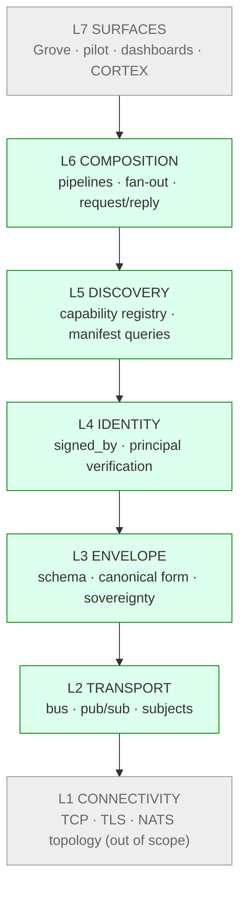

# Myelin Architecture

> **Scope:** This document defines myelin's seven-layer protocol stack — the contracts each layer guarantees, the code paths that own each layer, and the source-of-truth issues for each layer's evolving specification.
>
> **Stance:** Static reference. This document describes architecture, not progress. Implementation status, work-in-flight, and per-iteration milestones live in GitHub issues and `blueprint.yaml` — never here.
>
> **When to update this document:** When a layer's contract changes — a new layer is added, a layer's responsibility shifts, an inter-layer interface is renegotiated, a cross-layer invariant is added or rescinded. Routine implementation progress, in-flight PRs, and temporal status updates do NOT belong here.

---

## 1. Why myelin is layered

Myelin is the protocol stack the metafactory ecosystem runs on — the envelopes, transports, identities, and composition patterns that connect agents across operators. It is a stack, not a single thing.

The discipline of the OSI / TCP-IP layered model — narrow inter-layer interfaces, swappable implementations, explicit cross-layer concerns — is what made the internet's protocol stack durable across forty years of underlying-tech turnover. Myelin adopts the same discipline.

The seven-layer model below supersedes the v4 nervous-system five-layer naming (MYELIN / AXON / DENDRITE / SYNAPSE / CORTEX). Two changes from v4: Identity is named as its own layer, and CORTEX is repositioned as a Layer 7 application rather than a peer layer. Rationale in [myelin#5](https://github.com/the-metafactory/myelin/issues/5).

## 2. The stack

```
┌─────────────────────────────────────────────────────────────┐
│  L7  SURFACES        Grove · pilot · signal-collector ·     │
│                      dashboards · CORTEX (capability AI)    │
├─────────────────────────────────────────────────────────────┤
│  L6  COMPOSITION     Pipeline · fan-out/fan-in ·            │
│                      request/reply · negotiation            │
├─────────────────────────────────────────────────────────────┤
│  L5  DISCOVERY       Capability registry · manifest queries │
│                      · runtime type matching                │
├─────────────────────────────────────────────────────────────┤
│  L4  IDENTITY        Verifiable principal · signed_by       │
│                      · sovereignty attestation              │
├─────────────────────────────────────────────────────────────┤
│  L3  ENVELOPE        Envelope schema · canonical form ·     │
│                      sovereignty metadata · namespace       │
├─────────────────────────────────────────────────────────────┤
│  L2  TRANSPORT       Bus · pub/sub · request/reply ·        │
│                      delivery guarantees · subjects         │
├─────────────────────────────────────────────────────────────┤
│  L1  CONNECTIVITY    TCP · TLS · NATS leaf-node topology    │
│                      (out of scope — internet plumbing)     │
└─────────────────────────────────────────────────────────────┘
```



## 3. Per-layer summary

| Layer | Charter | Code path | Source-of-truth issue |
|---|---|---|---|
| **L7 Surfaces** | Applications consuming the stack | other repos (grove, pilot, signal-collector) | — |
| **L6 Composition** | Patterns for combining envelopes (pipeline, fan-out, request/reply, negotiation) | TBD | [#10](https://github.com/the-metafactory/myelin/issues/10) |
| **L5 Discovery** | Runtime queryable capability registry | TBD | [#9](https://github.com/the-metafactory/myelin/issues/9) |
| **L4 Identity** | Verifiable per-envelope principal; signed_by | `src/identity/` | [#8](https://github.com/the-metafactory/myelin/issues/8), [#31](https://github.com/the-metafactory/myelin/issues/31) |
| **L3 Envelope** | Envelope schema, canonical encoding, sovereignty metadata, NATS namespace | `src/envelope.ts`, `src/types.ts`, `schemas/envelope.schema.json`, `specs/namespace.md` | [#6](https://github.com/the-metafactory/myelin/issues/6) |
| **L2 Transport** | Abstract bus interface; pub/sub + request/reply; subject-based addressing | `src/transport/` | [#12](https://github.com/the-metafactory/myelin/issues/12) |
| **L1 Connectivity** | TCP, TLS, NATS leaf-node topology | not in this repo | — |

**Cross-layer:** [myelin#11](https://github.com/the-metafactory/myelin/issues/11) — sovereignty enforcement protocol that cuts across L3 (declared), L4 (attested), and L2 (enforced).

For the live status of any layer's work, follow its source-of-truth issue. For the historical iteration backlog (MY-100 / MY-200 / MY-300 / MY-400 IDs), see `blueprint.yaml`.

## 4. Layer details

### L1 — Connectivity

**Charter.** Internet plumbing: TCP, TLS, NATS server topology (operator hubs, leaf nodes, federation links). Out of scope for myelin — myelin runs on top of L1, does not define it.

**Why it is named.** Pretending the lower layer doesn't exist leads to buggy higher layers. Myelin assumes L1 provides authenticated, encrypted, ordered byte streams. If L1 fails (network partition, TLS expiry), every layer above degrades together — the layer model surfaces the dependency cleanly.

---

### L2 — Transport

**Charter.** Provide an abstract bus with pub/sub and request/reply semantics, subject-based addressing, and explicit delivery guarantees. Higher layers MUST NOT import a concrete transport (NATS, Kafka, HTTP, etc.) directly — they compose against the abstract `Transport` interface so implementations can be swapped without rewriting publishers and subscribers.

**Code.** `src/transport/`

- `types.ts` — `TransportPublisher`, `TransportSubscriber`, `EnvelopePublisher`, `EnvelopeSubscriber`, `Subscription` interfaces.
- `nats.ts` — NATS implementation.
- `in-memory.ts` — in-memory implementation (test substrate).
- `envelope.ts` — `EnvelopeTransport` wrapper for envelope canonicalization.
- `factory.ts` — config-driven transport selection.

**Source-of-truth issue.** [myelin#12](https://github.com/the-metafactory/myelin/issues/12).

**Open contract questions.**
- Delivery guarantees (at-most-once / at-least-once / exactly-once) are NATS-shaped today. A second transport would force these to become explicit per-method contracts.
- JetStream-specific semantics (pull consumers, durables) are reachable via the NATS implementation but not part of the abstract interface. Promotion to abstract is a future call.

---

### L3 — Envelope

**Charter.** Define the wire format every message uses: canonical schema, ID conventions, timestamp rules, sovereignty metadata, the NATS subject namespace, and the explicit boundary between signable and mutable fields. The envelope is the unit of sovereignty travel — *"sovereignty travels with the message"* is an L3 invariant.

**Code.**

- `src/envelope.ts` — `createEnvelope`, `validateEnvelope`.
- `src/types.ts` — `MyelinEnvelope` TypeScript interface.
- `schemas/envelope.schema.json` — JSON Schema (draft 2020-12).
- `specs/namespace.md` — local / federated / public NATS subject prefixes.

**Source-of-truth issue.** [myelin#6](https://github.com/the-metafactory/myelin/issues/6).

**Inside vs outside the signature.** The envelope distinguishes attested fields (inside the L4 signature) from mutable fields (`correlation_id`, `economics`, `extensions`). This is a load-bearing L3 invariant; the trust contract that follows from it (clients MUST NOT make trust decisions based on mutable values) is stated in §5.2.

---

### L4 — Identity

**Charter.** Provide a verifiable principal for every envelope, transport-independent. Receivers MUST be able to verify *who sent this message* without trusting the transport that delivered it. Identity verification is the substrate on which L6 sovereignty enforcement and accountability composition are built.

**Code.** `src/identity/`

- `types.ts` — `Principal`, `SignedBy` (Ed25519 + hub-stamp), `VerificationResult`.
- `canonicalize.ts` — JCS (RFC 8785) canonicalization for the signing payload.
- `sign.ts` — `signEnvelope`.
- `verify.ts` — `verifyEnvelopeIdentity`, `requireVerifiedIdentity`.
- `registry.ts` — `PrincipalRegistry` (file-backed and in-memory).

**Source-of-truth issues.**
- [myelin#8](https://github.com/the-metafactory/myelin/issues/8) — original L4 identity specification (single-stamp).
- [myelin#31](https://github.com/the-metafactory/myelin/issues/31) — chain-of-stamps proposal extending `signed_by` from a single signer to an ordered notary chain.

**Cross-layer notes.** L4 attests origin via single-stamp signatures and attests path via chain-of-stamps. Path attestation is the prerequisite for L6 sovereignty enforcement at every hop, not just at L1 of trust.

---

### L5 — Discovery

**Charter.** Make the set of available capabilities runtime-queryable. An agent MUST be able to ask *"who can summarize text right now?"* without prior knowledge of peer subjects. Capability matching considers live availability, sovereignty, and quality signals.

**Source-of-truth issue.** [myelin#9](https://github.com/the-metafactory/myelin/issues/9).

---

### L6 — Composition

**Charter.** Formalize the patterns by which envelopes combine into useful workflows: pipelines, fan-out / fan-in, request/reply, negotiation. Common patterns get formal specifications so that consuming repos do not reinvent them per use.

**Source-of-truth issue.** [myelin#10](https://github.com/the-metafactory/myelin/issues/10).

---

### L7 — Surfaces

**Charter.** Applications that consume the stack — Grove, pilot, signal-collector, dashboards, CORTEX (capability AI). Out of scope for *this* repo — myelin does not own L7 implementations. L7 is named here because its existence shapes the contracts the layers below must offer; per-application architecture lives in each consuming repo.

## 5. Cross-layer invariants

Some concerns deliberately span layers and cannot live in any single one. The model names them explicitly so they are not lost.

### 5.1 Sovereignty (declared L3, attested L4, enforced L2)

Sovereignty metadata is *declared* in the envelope at L3, *cryptographically attested* via `signed_by` at L4, and *enforced* at L2 — the transport refuses to route an envelope across an operator boundary unless the sovereignty claim is satisfied. The protocol that binds the three layers is specified in [myelin#11](https://github.com/the-metafactory/myelin/issues/11).

### 5.2 Mutable fields are NOT trust-bearing

`correlation_id`, `economics`, and `extensions` are intentionally outside the L4 signature so intermediaries can annotate observability and economics state without invalidating attestations. **Hard contract:** clients MUST NOT make security or trust decisions based on mutable-field values. Anything that needs to be both mutable AND attested is a signal to add a new attested mechanism, not to expand the carve-out.

### 5.3 Transport-independence

L4 identity verification MUST work regardless of which L2 transport delivered the envelope. The signature covers envelope content, not transport metadata. A principal's identity is the same whether the message rode NATS, an HTTP webhook bridge, or anything else.

### 5.4 Operator sovereignty over registries

Each operator owns its principal registry (L4) and its capability registry (L5). There is no global authority. Cross-operator trust is established by explicit federation handshake.

## 6. Design conventions

These are repo-wide conventions that follow from the layered model:

- **No layer skipping in code.** Higher-layer code does not import lower-layer concrete implementations directly. L7 code that needs to publish does so through L3+L4 (envelope + signed_by) over L2 (abstract transport), never by speaking NATS directly.
- **Contract changes update this doc.** A change that adds, removes, or alters a layer's responsibility — a new inter-layer interface, a new cross-layer invariant, a renegotiated boundary — updates the relevant section here in the same PR. Implementation progress does not.
- **Cross-layer concerns get their own section here.** Don't wedge them into a single layer. §5 is the place.
- **External repos consume contracts, never internals.** Grove, pilot, signal-collector, etc. depend on the layers' published APIs (`@the-metafactory/myelin` exports, schema, namespace spec). They do not import private files from this repo.
- **Issue lineage matches doc lineage.** Per `compass/sops/design-process.md`: research → DD → spec → issue → code. Each layer here points to its source-of-truth issue.

## 7. Glossary

- **Envelope** — the universal message format. Every signal that crosses myelin is wrapped in one.
- **Principal** — the verifiable identity of the sender. `did:mf:<name>` shape, ed25519 key, registry-resolvable.
- **Sovereignty** — declarative metadata about who owns / classifies / constrains a message. Travels with the envelope.
- **Hub-stamp** — a signing method where a trusted hub signs on behalf of an agent that does not directly hold a key.
- **JCS** — JSON Canonicalization Scheme, RFC 8785. Used at L4 to produce deterministic signing bytes.
- **Operator** — a metafactory deployment under a single trust boundary (e.g. `metafactory.grove`). Sovereignty boundaries follow operator boundaries.
