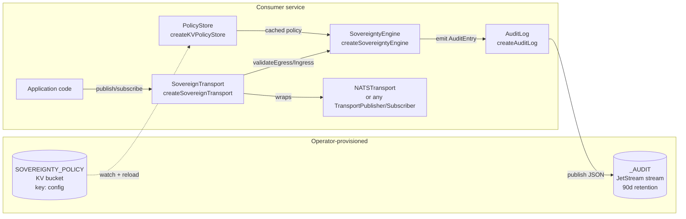

# F-5 Sovereignty Engine — Architecture

> Architecture-side companion to
> [`docs/sovereignty-operator.md`](./sovereignty-operator.md). The
> operator guide tells you **how** to provision policy, wire the
> wrapper, and respond to incidents. This doc covers **what** the
> engine does on the hot path, **why** it's shaped the way it is, and
> **where** each block decision originates.

---

## 1. What the engine enforces

F-5 enforces two boundaries:

- **Egress**: an envelope leaving a service must target a subject the
  policy allows for the envelope's `classification` and
  `data_residency`. If `block_local_escape` is set, a `local`-
  classified envelope can never escape the `local.>` namespace.
- **Ingress**: an envelope arriving from a federation partner must
  carry a `signed_by.principal` mapped to a known partner with a
  scope ceiling that covers both the target subject and any
  declared `requirements`.

Everything else (authorization, RBAC, rate limiting, economics) is
out of scope and lives in other modules (cf. spec §Out of Scope).

## 2. Design principles

The engine is built around five non-negotiable invariants:

1. **Fail closed.** Engine refuses to start if the policy KV is
   missing or invalid. No advisory mode. No best-effort. A live
   engine always has a validated policy. Implementation:
   `createKVPolicyStore({ kv }).reload()` throws on bad state; the
   transport wrapper holds the engine.
2. **Hot path is "allow".** Decisions on conforming envelopes return
   in nanoseconds with zero JetStream / KV traffic. Policy is held
   in process memory; the KV watcher updates the cache out-of-band.
3. **Audit is fire-and-forget.** Validation never awaits an audit
   publish. Audit failures surface through `onPublishError` /
   `onAuditError` callbacks (defaulting to `console.error`) but
   never block, never throw, never cancel the decision.
4. **Decisions are structured, not stringly.** Every block carries a
   `NakReasonCode` from a closed enum (six values, see §6). Operators
   filter and alert on the code, not on a substring of the reason
   string.
5. **Policy enforcement is centralized; subject reachability is
   federated.** The sovereignty engine gates **principal** scope at
   the envelope layer. NSC gates **subject** flow at the NATS layer.
   Both must agree (see §7).

## 3. Component topology



Key data flows:

- **Cold path** (KV → PolicyStore): KV `watch()` emits put events;
  the store revalidates the JSON, swaps the cache atomically, fires
  `onChange` callbacks. ~100ms debounce.
- **Hot path** (App → ST → Engine): single in-process call chain,
  no IO. Returns a typed `SovereigntyValidationResult` to the
  wrapper, which converts blocks into thrown errors / silent
  drops + structured naks.
- **Audit path** (Engine → AuditLog → JetStream): fire-and-forget.
  Engine builds an `AuditEntry`, calls `auditLog.emit(entry)` which
  returns synchronously after spawning a publish promise. Promise
  failure → `onPublishError` callback. The engine itself wraps the
  emit call in `try/catch` (`onAuditError`) so even a synchronous
  throw from a misconfigured audit log cannot reach the caller.

## 4. Egress decision flow

```mermaid
flowchart TD
  start([validateEgress envelope, targetSubject])
  start --> read[Read cached policy]
  read --> q1{block_local_escape AND<br/>cls = local AND<br/>NOT targetSubject startsWith local.}
  q1 -- yes --> block1[Block:<br/>classification-mismatch<br/>'block_local_escape']
  q1 -- no --> q2{Subject prefix in<br/>local | federated | public?}
  q2 -- no --> block2[Block:<br/>classification-mismatch<br/>'no classification prefix']
  q2 -- yes --> q3{cls allowed to reach<br/>subject's prefix?}
  q3 -- no --> block3[Block:<br/>classification-mismatch]
  q3 -- yes --> q4{Egress rule exists<br/>for cls?}
  q4 -- no --> block4[Block:<br/>classification-mismatch<br/>'no rule for cls']
  q4 -- yes --> q5{targetSubject matches<br/>rule.allowed_subjects?}
  q5 -- no --> block5[Block:<br/>classification-mismatch<br/>'not in allowed_subjects']
  q5 -- yes --> q6{rule.data_residency_constraints<br/>has envelope.data_residency?}
  q6 -- no --> allow([Allow])
  q6 -- yes --> q7{targetSubject matches<br/>any constraint pattern?}
  q7 -- yes --> allow
  q7 -- no --> block6[Block:<br/>residency-violation]
```

Classification reachability budget (implemented as a static map):

| Envelope `classification` | May target subjects starting with |
|---|---|
| `local` | `local.*` |
| `federated` | `local.*`, `federated.*` |
| `public` | `local.*`, `federated.*`, `public.*` |

A `public` envelope deliberately retains the option to publish to a
`local.*` subject (e.g. internal observability copy of a public
event); the reverse is never allowed.

## 5. Ingress decision flow

```mermaid
flowchart TD
  start([validateIngress envelope, sourceSubject])
  start --> q1{envelope.signed_by.principal<br/>present?}
  q1 -- no --> block1[Block:<br/>unknown-principal<br/>'unsigned envelope']
  q1 -- yes --> q2{principal in any<br/>scope_mappings[].imported_principals?}
  q2 -- no --> q3{reject_unknown_partners?}
  q3 -- yes --> block2[Block:<br/>unknown-principal<br/>'no scope mapping']
  q3 -- no --> allow1([Allow<br/>permissive mode])
  q2 -- yes --> q4{sourceSubject matches<br/>mapping.local_scope?}
  q4 -- no --> block3[Block:<br/>scope-exceeded<br/>'subject outside scope']
  q4 -- yes --> q5{envelope.requirements ⊆<br/>mapping.max_capabilities?}
  q5 -- no --> block4[Block:<br/>scope-exceeded<br/>'requirement exceeds ceiling']
  q5 -- yes --> allow2([Allow])
```

Note that the engine has no built-in concept of "partner-unknown" as
a state distinct from "unknown principal". The
`compliance-block:partner-unknown` code is reserved for callers that
want to distinguish whole-partner-org rejection from per-principal
rejection — useful in higher-level observability dashboards, not in
the validator itself.

## 6. NakReasonCode reference

The closed enum lives in `src/sovereignty/types.ts`:

```ts
export type NakReasonCode =
  | "compliance-block:classification-mismatch"
  | "compliance-block:residency-violation"
  | "compliance-block:unknown-principal"
  | "compliance-block:scope-exceeded"
  | "compliance-block:chain-invalid"
  | "compliance-block:partner-unknown";
```

| Code | Surface | Trigger | Operator action |
|---|---|---|---|
| `classification-mismatch` | egress | `block_local_escape`, missing subject prefix, cross-classification violation, no rule for classification, target not in `allowed_subjects` | Verify envelope classification + policy `allowed_subjects` for that classification |
| `residency-violation` | egress | Rule has `data_residency_constraints[envelope.data_residency]` and target doesn't match any constraint pattern | Widen constraint patterns or correct envelope residency at the source |
| `unknown-principal` | ingress | Envelope unsigned OR principal not in any mapping AND `reject_unknown_partners: true` | Add the partner DID to `imported_principals`, or accept the rejection |
| `scope-exceeded` | ingress | Known principal but target subject outside `local_scope`, OR a `requirements[]` entry exceeds `max_capabilities` | Widen `local_scope` / `max_capabilities`, or correct the source claim |
| `partner-unknown` | ingress (advisory) | Reserved — higher-level callers may distinguish whole-partner rejection from per-principal rejection. Not emitted by the current validator. | Add scope mapping for the partner |
| `chain-invalid` | ingress (T-6.x, gated) | Reserved for chain-of-stamps verification. Currently off (`verify_delegation_sovereignty: false` default). | Enable once myelin#31 (multi-signer chain) lands |

Operator guide §5 cross-references this table for runbook
recovery.

## 7. Federation: NSC and the engine

Federation is a two-layer enforcement system. Both layers must agree
on a partner traffic flow for it to function.

| Layer | Owned by | Gates | Reject path |
|---|---|---|---|
| NSC export/import | Operator (via `nsc` CLI) | Cross-account subject reachability at the NATS layer | NATS-level permission deny (`no responders`, leaf node block) |
| `validateIngress` | Engine | `signed_by.principal` ∈ partner's `imported_principals` and target subject ∈ `local_scope` | `compliance-block:unknown-principal` / `:scope-exceeded` nak |

The NSC layer is what makes federation **possible** — without an
export on the partner side and a matching import on ours, the message
never reaches our cluster. The engine layer is what makes federation
**safe** — even with the NATS pipe open, the envelope must satisfy
the partner's scope contract before any application handler sees it.

Configuration is symmetric: `generateFederationScript(policy)`
emits the NSC half from the same `SovereigntyPolicy` document that
drives the engine half. See operator guide §7 for the script-apply
workflow and the non-atomic update ordering between the two layers.

## 8. SovereignTransport — block surface

`createSovereignTransport({ transport, engine })` wraps a
`TransportPublisher + TransportSubscriber` and produces three
observable effects on a block:

| Surface | Producer path | Consumer path |
|---|---|---|
| Thrown `SovereigntyBlockedError` | `publish()` rejects with this error so the caller learns the request was refused | (subscribe path acks-and-drops; handler is never invoked) |
| Structured nak envelope | `_nak.sovereignty.egress.<envelope_id>` published synthesized by the wrapper | `_nak.sovereignty.ingress.<envelope_id>` |
| `AuditEntry` on `_AUDIT` | `_audit.sovereignty.block.egress` | `_audit.sovereignty.block.ingress` |

Allow paths also emit `_audit.sovereignty.allow.<direction>` entries
when an `auditLog` is bound. This makes the audit log a complete
decision record, not just a block log.

The nak envelope rides as a normal `MyelinEnvelope` with a typed
`SovereigntyNakDetail` payload — see `src/sovereignty/transport.ts`
for the exact shape. The nak is published through the underlying
transport directly (not through the wrapper) to avoid recursive
validation.

## 9. Performance characteristics

| Metric | Current | Target (T-7.2) |
|---|---|---|
| Allow-path latency | ~µs (object property reads + array `.some()` over typically 1-3 patterns) | p99 < 1ms under 10k validations/s |
| Allocations per allow | Zero (returns the cached `{ valid: true }` literal) | Zero (unchanged) |
| Allocations per block | One `SovereigntyValidationResult` object | One (unchanged) |
| Audit hot-path cost | Single `JSON.stringify` + `TextEncoder.encode` + fire-and-forget promise | Same |
| Policy hot-reload latency | ~100ms (KV watch debounce) | Same |

T-7.2 will (a) pre-compile `subjectMatchesPattern` into a `RegExp`
cache keyed on the pattern string, invalidated on policy swap, and
(b) ship a `bench/sovereignty.bench.ts` harness that runs 10k mixed
validations and asserts the p99 budget. The harness becomes a
regression guard for any future hot-path edit.

## 10. Chain-of-stamps integration (T-6.x, deferred)

Once myelin#31 (multi-signer chain) lands, the engine will gain a
third validator slot — a verifier that walks the envelope's
`signed_by[]` chain and asserts each stamp's principal has sovereignty
to claim the next hop. Activated by setting
`chain_of_stamps.verify_delegation_sovereignty: true` in the policy.
Blocks surface as `compliance-block:chain-invalid`.

Until then, the field stays `false` (default) and the validator
slot is dormant.

## 11. Extension points

The engine deliberately exposes minimal seams. Two are stable:

- **`SovereigntyEngineOptions.now`** — clock injection. Tests use it
  to assert deterministic audit timestamps.
- **`SovereigntyEngineOptions.onAuditError`** — synchronous-throw
  handler from the audit emit path. Production services typically
  bind this to a structured logger; tests bind it to a spy.

The validators themselves (`validateEgress`, `validateIngress`,
`lookupPrincipalScope`, `checkScopeCeiling`, `checkClassificationAlignment`,
`checkDataResidency`) are exported as pure functions so a service
with unusual requirements can compose its own engine — but the
default `createSovereigntyEngine` covers every documented case.

## See also

- [`docs/sovereignty-operator.md`](./sovereignty-operator.md) —
  operator guide (provisioning, hot reload, failure recovery,
  federation script application).
- `.specify/specs/f-5-sovereignty-policy-engine/spec.md` — feature
  spec and the decisions of record.
- `src/sovereignty/types.ts` — shared types and the `NakReasonCode`
  enum.
- `src/sovereignty/schema.ts` — `validatePolicy` / `assertPolicy`.
- `src/sovereignty/policy-store.ts` — KV-backed store + watch.
- `src/sovereignty/audit-log.ts` — JetStream audit stream + emit.
- `src/sovereignty/engine.ts` — engine factory.
- `src/sovereignty/validators/egress.ts` — egress validator.
- `src/sovereignty/validators/ingress.ts` — ingress validator.
- `src/sovereignty/transport.ts` — `SovereignTransport` wrapper.
- `src/sovereignty/nsc.ts` — NSC federation command generation.
