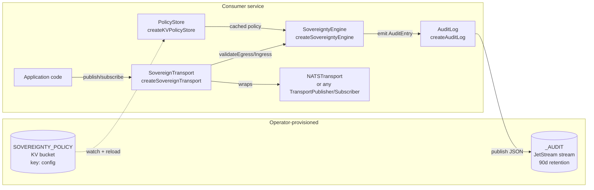

# F-5 Sovereignty Engine — Architecture

> Architecture-side companion to
> [`docs/sovereignty-operator.md`](./sovereignty-operator.md). The
> operator guide tells you **how** to provision policy, wire the
> wrapper, and respond to incidents. This doc covers **what** the
> engine does on the hot path, **why** it's shaped the way it is, and
> **where** each block decision originates.

---

## 1. What the engine enforces

F-5 enforces two boundaries:

- **Egress**: an envelope leaving a service must target a subject the
  policy allows for the envelope's `classification` and
  `data_residency`. If `block_local_escape` is set, a `local`-
  classified envelope can never escape the `local.>` namespace.
- **Ingress**: an envelope arriving from a federation partner must
  carry a `signed_by.principal` mapped to a known partner with a
  scope ceiling that covers both the target subject and any
  declared `requirements`.

Everything else (authorization, RBAC, rate limiting, economics) is
out of scope and lives in other modules (cf. spec §Out of Scope).

## 2. Design principles

The engine is built around five non-negotiable invariants:

1. **Fail closed.** Engine refuses to start if the policy KV is
   missing or invalid. No advisory mode. No best-effort. A live
   engine always has a validated policy. Implementation:
   `createKVPolicyStore({ kv }).reload()` throws on bad state; the
   transport wrapper holds the engine.
2. **Hot path is "allow".** Decisions on conforming envelopes return
   in nanoseconds with zero JetStream / KV traffic. Policy is held
   in process memory; the KV watcher updates the cache out-of-band.
3. **Audit is fire-and-forget.** Validation never awaits an audit
   publish. Audit failures surface through `onPublishError` /
   `onAuditError` callbacks (defaulting to `console.error`) but
   never block, never throw, never cancel the decision.
4. **Decisions are structured, not stringly.** Every block carries a
   `NakReasonCode` from a closed enum (six values, see §6). Operators
   filter and alert on the code, not on a substring of the reason
   string.
5. **Policy enforcement is centralized; subject reachability is
   federated.** The sovereignty engine gates **principal** scope at
   the envelope layer. NSC gates **subject** flow at the NATS layer.
   Both must agree (see §7).

## 3. Component topology



Key data flows:

- **Cold path** (KV → PolicyStore): KV `watch()` emits put events;
  the store revalidates the JSON and swaps the in-process cache so
  subsequent `get()` calls return the new policy. ~100ms debounce.
  Schema-invalid payloads are rejected and routed to
  `onInvalidUpdate` (defaults to `console.error`); the prior policy
  stays cached. Single-threaded JS event-loop semantics make the
  swap visible-or-not-visible to any single `get()` — there is no
  partial-update window.
- **Hot path** (App → ST → Engine): single in-process call chain,
  no IO. Returns a typed `SovereigntyValidationResult` to the
  wrapper, which converts blocks into thrown errors / silent
  drops + structured naks.
- **Audit path** (Engine → AuditLog → JetStream): fire-and-forget.
  Engine builds an `AuditEntry`, calls `auditLog.emit(entry)` which
  returns synchronously after spawning a publish promise. Promise
  failure → `onPublishError` callback. The engine itself wraps the
  emit call in `try/catch` (`onAuditError`) so even a synchronous
  throw from a misconfigured audit log cannot reach the caller.

## 4. Egress decision flow

```mermaid
flowchart TD
  start([validateEgress envelope, targetSubject])
  start --> read[Read cached policy]
  read --> q1{block_local_escape AND<br/>cls = local AND<br/>NOT targetSubject startsWith local.}
  q1 -- yes --> block1[Block:<br/>classification-mismatch<br/>'block_local_escape']
  q1 -- no --> q2{Subject prefix in<br/>local | federated | public?}
  q2 -- no --> block2[Block:<br/>classification-mismatch<br/>'no classification prefix']
  q2 -- yes --> q3{cls allowed to reach<br/>subject's prefix?}
  q3 -- no --> block3[Block:<br/>classification-mismatch]
  q3 -- yes --> q4{Egress rule exists<br/>for cls?}
  q4 -- no --> block4[Block:<br/>classification-mismatch<br/>'no rule for cls']
  q4 -- yes --> q5{targetSubject matches<br/>rule.allowed_subjects?}
  q5 -- no --> block5[Block:<br/>classification-mismatch<br/>'not in allowed_subjects']
  q5 -- yes --> q6{rule.data_residency_constraints<br/>has envelope.data_residency?}
  q6 -- no --> allow([Allow])
  q6 -- yes --> q7{targetSubject matches<br/>any constraint pattern?}
  q7 -- yes --> allow
  q7 -- no --> block6[Block:<br/>residency-violation]
```

Classification reachability budget (implemented as a static map):

| Envelope `classification` | May target subjects starting with |
|---|---|
| `local` | `local.*` |
| `federated` | `local.*`, `federated.*` |
| `public` | `local.*`, `federated.*`, `public.*` |

A `public` envelope deliberately retains the option to publish to a
`local.*` subject (e.g. internal observability copy of a public
event); the reverse is never allowed.

## 5. Ingress decision flow

```mermaid
flowchart TD
  start([validateIngress envelope, sourceSubject])
  start --> q1{envelope.signed_by.principal<br/>present?}
  q1 -- no --> block1[Block:<br/>unknown-principal<br/>'unsigned envelope']
  q1 -- yes --> q2{principal in any<br/>scope_mappings[].imported_principals?}
  q2 -- no --> q3{reject_unknown_partners?}
  q3 -- yes --> block2[Block:<br/>unknown-principal<br/>'no scope mapping']
  q3 -- no --> allow1([Allow<br/>permissive mode])
  q2 -- yes --> q4{sourceSubject matches<br/>mapping.local_scope?}
  q4 -- no --> block3[Block:<br/>scope-exceeded<br/>'subject outside scope']
  q4 -- yes --> q5{envelope.requirements ⊆<br/>mapping.max_capabilities?}
  q5 -- no --> block4[Block:<br/>scope-exceeded<br/>'requirement exceeds ceiling']
  q5 -- yes --> allow2([Allow])
```

## 6. NakReasonCode reference

The closed enum lives in `src/sovereignty/types.ts`:

```ts
export type NakReasonCode =
  | "compliance-block:classification-mismatch"
  | "compliance-block:residency-violation"
  | "compliance-block:unknown-principal"
  | "compliance-block:scope-exceeded"
  | "compliance-block:chain-invalid"
  | "compliance-block:partner-unknown";
```

| Code | Surface | Trigger | Operator action |
|---|---|---|---|
| `classification-mismatch` | egress | `block_local_escape`, missing subject prefix, cross-classification violation, no rule for classification, target not in `allowed_subjects` | Verify envelope classification + policy `allowed_subjects` for that classification |
| `residency-violation` | egress | Rule has `data_residency_constraints[envelope.data_residency]` and target doesn't match any constraint pattern | Widen constraint patterns or correct envelope residency at the source |
| `unknown-principal` | ingress | Envelope unsigned OR principal not in any mapping AND `reject_unknown_partners: true` | Add the partner DID to `imported_principals`, or accept the rejection |
| `scope-exceeded` | ingress | Known principal but target subject outside `local_scope`, OR a `requirements[]` entry exceeds `max_capabilities` | Widen `local_scope` / `max_capabilities`, or correct the source claim |
| `partner-unknown` | ingress (advisory) | Reserved code. Whole-partner-org rejection currently surfaces as `unknown-principal` — the validator doesn't distinguish "principal not in any mapping" from "partner not configured". Higher-level observability (dashboards, audit aggregators) may upgrade `unknown-principal` to `partner-unknown` when the principal's DID prefix matches a known-but-unmapped org. | Add scope mapping for the partner |
| `chain-invalid` | ingress (gated) | Chain-of-stamps validator (T-6.1) rejected a multi-stamp delegation: empty chain, > `MAX_CHAIN_LENGTH`, or a stamp whose principal has no scope mapping under `reject_unknown_partners: true`. Off by default (`verify_delegation_sovereignty: false`); flip the flag to enable. | Add the principal to the appropriate `imported_principals` list, or accept the rejection |

Operator guide §5 cross-references this table for runbook
recovery. The two tables are intentionally similar but not
identical — the architecture doc here covers the `max_capabilities`
dimension of `scope-exceeded` and the `unknown-principal` overlap
with `partner-unknown`, while the operator guide is tuned for
runbook brevity.

## 7. Federation: NSC and the engine

Federation is a two-layer enforcement system. Both layers must agree
on a partner traffic flow for it to function.

| Layer | Owned by | Gates | Reject path |
|---|---|---|---|
| NSC export/import | Operator (via `nsc` CLI) | Cross-account subject reachability at the NATS layer | NATS-level permission deny (`no responders`, leaf node block) |
| `validateIngress` | Engine | `signed_by.principal` ∈ partner's `imported_principals` and target subject ∈ `local_scope` | `compliance-block:unknown-principal` / `:scope-exceeded` nak |

The NSC layer is what makes federation **possible** — without an
export on the partner side and a matching import on ours, the message
never reaches our cluster. The engine layer is what makes federation
**safe** — even with the NATS pipe open, the envelope must satisfy
the partner's scope contract before any application handler sees it.

Configuration is symmetric: `generateFederationScript(policy)`
emits the NSC half from the same `SovereigntyPolicy` document that
drives the engine half. See operator guide §7 for the script-apply
workflow and the non-atomic update ordering between the two layers.

## 8. SovereignTransport — block surface

`createSovereignTransport({ transport, engine })` wraps a
`TransportPublisher + TransportSubscriber`. Blocks produce different
observable effects depending on which entry point the application
called:

| Entry point | Thrown error | Structured nak | AuditEntry | `onIngressBlock` observer |
|---|---|---|---|---|
| `publish()` | `SovereigntyBlockedError` reaches the producer | `_nak.sovereignty.egress.<envelope_id>` | `_audit.sovereignty.block.egress` | n/a |
| `subscribe()` handler | none (ack-and-drop, handler never called) | `_nak.sovereignty.ingress.<envelope_id>` | `_audit.sovereignty.block.ingress` | fires |
| `subscribeBestEffort()` handler | none (silent drop, handler never called) | **none — no nak envelope on the wire** | `_audit.sovereignty.block.ingress` | fires |

The asymmetry matters operationally: `subscribeBestEffort` is for
fire-and-forget consumers where a nak round-trip would be wasteful.
But that means alerting based purely on `_nak.sovereignty.>` traffic
will miss `subscribeBestEffort` blocks — pin alerts to the audit
stream (`_audit.sovereignty.block.>`) for full coverage, or wire
the `onIngressBlock` observer for in-process notification.

Allow paths also emit `_audit.sovereignty.allow.<direction>` entries
when an `auditLog` is bound. This makes the audit log a complete
decision record, not just a block log.

The nak envelope rides as a normal `MyelinEnvelope` with a typed
`SovereigntyNakDetail` payload — see `src/sovereignty/transport.ts`
for the exact shape. The nak is published through the underlying
transport directly (not through the wrapper) to avoid recursive
validation.

## 9. Performance characteristics

Measured by `bench/sovereignty.bench.ts` running 10000 mixed
validations (~70% allow, ~30% block across all six block paths)
against `testPolicy`, after 1000 warm-up iterations, on the
reference dev box. Re-run anytime with `bun run bench`.

| Metric | Measured | Budget |
|---|---|---|
| Allow-path p50 latency | ~0.4 µs | — |
| Allow-path p95 latency | ~0.7 µs | — |
| Hot-path p99 latency (mixed allow + block) | ~2-3 µs | p99 < 1000 µs |
| Hot-path mean latency | ~0.5 µs | — |
| Allocations per allow | Zero — both validators return a hoisted, frozen `ALLOW` literal | Zero |
| Allocations per block | One `SovereigntyValidationResult` object | One |
| Subject-pattern compile | Cached at `subject-matching.ts` module scope, keyed on pattern string, invalidated on policy swap | One compile per distinct pattern per policy generation |
| Audit hot-path cost | Single `JSON.stringify` + `TextEncoder.encode` + fire-and-forget promise | Same |
| Policy hot-reload latency | ~100ms (KV watch debounce) | Same |

T-7.2 shipped:

- **Compiled-pattern cache.** `compileSubjectPattern(pattern)` memoizes
  the `RegExp` per distinct pattern string in a module-level `Map`.
  The same `subjectMatchesPattern` call sites (`validateEgress`'s
  `allowed_subjects.some(...)`, the residency-constraint check, and
  `validateIngress`'s `local_scope.some(...)`) now hit the cache
  rather than re-allocating a fresh `RegExp` per validation per
  pattern. Cache invalidation: both `createInMemoryPolicyStore.set()`
  and the KV store's `applyRaw()` / `reload()` swap call
  `clearSubjectPatternCache()` so the cache never retains compiled
  forms for patterns that have left the live policy.
- **Bench harness.** `bench/sovereignty.bench.ts` runs N validations
  (default 10000), prints p50/p95/p99/max/mean, and exits non-zero
  if p99 ≥ the configured budget (default 1000 µs). Wired to
  `bun run bench`. Not picked up by `bun test` (the file uses
  `.bench.ts`, not `.test.ts`). Run knobs: `--iterations <N>`,
  `--warmup <N>`, `--budget-us <µs>`, `--quiet`.

The harness doubles as a regression guard for any future hot-path
edit — a change that pushes p99 above the budget fails the bench.

## 10. Chain-of-stamps integration (T-6.1, shipped)

myelin#31 (multi-signer chain) is merged, and the engine now has a
third validator slot: `verifyChainSovereignty` in
`src/sovereignty/validators/chain.ts`. It walks the envelope's
`signed_by[]` chain and asserts every stamp's principal appears in
some `ingress.scope_mappings[].imported_principals` under the
current policy. Blocks surface as
`compliance-block:chain-invalid` and name the offending stamp index
in `reason`.

| Condition | Result |
|---|---|
| `chain_of_stamps.verify_delegation_sovereignty: false` (default) | Skipped — last-stamp ingress check runs unchanged |
| Single-stamp envelope | Skipped — existing last-stamp check covers it |
| Empty chain | `chain-invalid` |
| Chain > `MAX_CHAIN_LENGTH` (16) | `chain-invalid` |
| Multi-stamp chain, any stamp's principal not in mappings, `reject_unknown_partners: true` | `chain-invalid` naming the first offending stamp |
| Multi-stamp chain, all principals in mappings | Allow (last-stamp ingress check still runs after) |
| Same chain under `reject_unknown_partners: false` | Allow (permissive — single-stamp ingress check is symmetric) |

This is a SOVEREIGNTY check (does the principal have a scope
mapping?), not a SIGNATURE check (did the principal actually sign?).
Signature verification is the identity layer's responsibility
(`verifyEnvelopeIdentity` in `src/identity/verify.ts`). Both layers
must agree for a chain to be both authentic and authorized — the
sovereignty engine assumes signature verification has already
happened upstream (typically at the transport boundary).

Activation: set `chain_of_stamps.verify_delegation_sovereignty: true`
in the policy KV. Hot reload applies on the next ~100ms tick. No
service restart.

## 11. Extension points

The engine deliberately exposes minimal seams. Two are stable:

- **`SovereigntyEngineOptions.now`** — clock injection. Tests use it
  to assert deterministic audit timestamps.
- **`SovereigntyEngineOptions.onAuditError`** — synchronous-throw
  handler from the audit emit path. Production services typically
  bind this to a structured logger; tests bind it to a spy.

The validators themselves (`validateEgress`, `validateIngress`,
`lookupPrincipalScope`, `checkScopeCeiling`, `checkClassificationAlignment`,
`checkDataResidency`) are exported as pure functions so a service
with unusual requirements can compose its own engine — but the
default `createSovereigntyEngine` covers every documented case.

## 12. Trusted substrates (DD-122, myelin#192)

DD-122 (meta-factory `design/design-decisions.md`) resolved that the
principal boundary extends to principal-owned cloud tenancy **iff
declared**: the policy's optional `trusted_substrates` section lists,
deny-by-default, the non-local substrates a principal accepts per
component role.

```jsonc
"trusted_substrates": [
  {
    "provider": "cloudflare",          // substrate operator slug
    "tenancy": "<account id>",         // principal-owned tenancy id (opaque, exact match)
    "roles": ["reflex-edge"],          // component roles allowed there
    "data_residency_accepted": true     // DD-122 point 4(a): payload plaintext
                                        // at rest on this substrate is accepted
  }
]
```

Semantics:

- **Deny-by-default.** Absent section, empty array, or unmatched
  entry → the component must not consume or produce `local`-classified
  traffic from that substrate. Pre-existing policy JSON (no section)
  loads unchanged.
- **Exact matching.** `provider` and `tenancy` compare by string
  equality; `role` by exact membership in `roles[]`. No wildcards — a
  declaration names one tenancy, deliberately.
- **`data_residency_accepted`** expresses DD-122 point 4 resolution
  (a): declared acceptance of payload plaintext at rest. Roles that
  persist payloads (e.g. `reflex-edge` writing decision rows to D1)
  require `true`; a `false` entry trusts the substrate for
  transit/compute only.

Runtime self-assert (`src/sovereignty/substrates.ts`, also exported
from `@the-metafactory/myelin/edge`):

```ts
import { assertPolicy, findTrustedSubstrate } from "@the-metafactory/myelin/edge";

assertPolicy(policy);
const sub = findTrustedSubstrate(policy, "cloudflare", env.CF_ACCOUNT_ID, "reflex-edge");
if (!sub) throw new Error("substrate not declared in trusted_substrates — refusing to start");
if (!sub.data_residency_accepted) throw new Error("payload-persisting role requires data_residency_accepted");
```

`isSubstrateTrusted(policy, provider, tenancy, role)` is the boolean
form; it does **not** check `data_residency_accepted`.

Scope honestly: this section is the declared-intent + audit surface,
not enforcement. A runtime that never loads the policy is unaffected.
The enforcement teeth are the scoped NSC credentials provisioned
against this section (DD-122 point 3) — without matching creds the
substrate cannot reach the bus at all. The two layers mirror §7's
NSC/engine split: credentials make the substrate **able** to
participate; the declaration makes participation **legitimate** and
gives the runtime grounds to refuse startup on an undeclared
substrate.

Validation joins the existing policy load path (`validatePolicy` /
`assertPolicy` in `src/sovereignty/schema.ts`): a present section is
strictly validated (`validateTrustedSubstrate` per entry), and a
schema-invalid policy is rejected wholesale — same fail-closed
behavior as every other section (§2 invariant 1).

## See also

- [`docs/sovereignty-operator.md`](./sovereignty-operator.md) —
  operator guide (provisioning, hot reload, failure recovery,
  federation script application).
- `.specify/specs/f-5-sovereignty-policy-engine/spec.md` — feature
  spec and the decisions of record.
- `src/sovereignty/types.ts` — shared types and the `NakReasonCode`
  enum.
- `src/sovereignty/schema.ts` — `validatePolicy` / `assertPolicy`.
- `src/sovereignty/policy-store.ts` — KV-backed store + watch.
- `src/sovereignty/audit-log.ts` — JetStream audit stream + emit.
- `src/sovereignty/engine.ts` — engine factory.
- `src/sovereignty/validators/egress.ts` — egress validator.
- `src/sovereignty/validators/ingress.ts` — ingress validator.
- `src/sovereignty/transport.ts` — `SovereignTransport` wrapper.
- `src/sovereignty/nsc.ts` — NSC federation command generation.
- `src/sovereignty/substrates.ts` — trusted-substrates lookup
  (`isSubstrateTrusted` / `findTrustedSubstrate`, DD-122).
